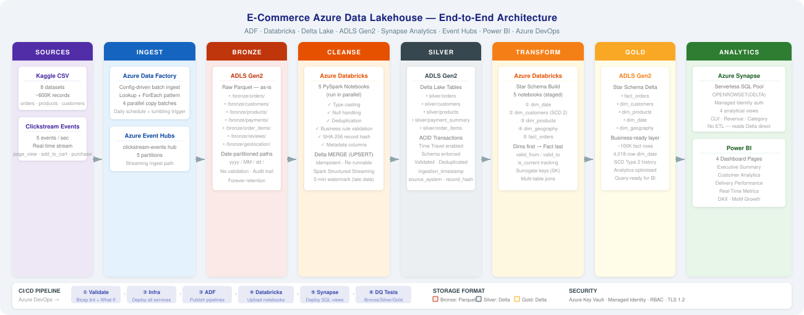
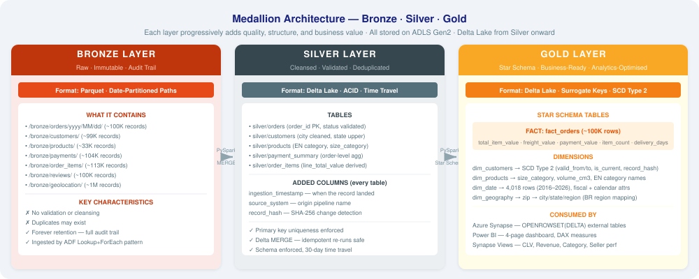
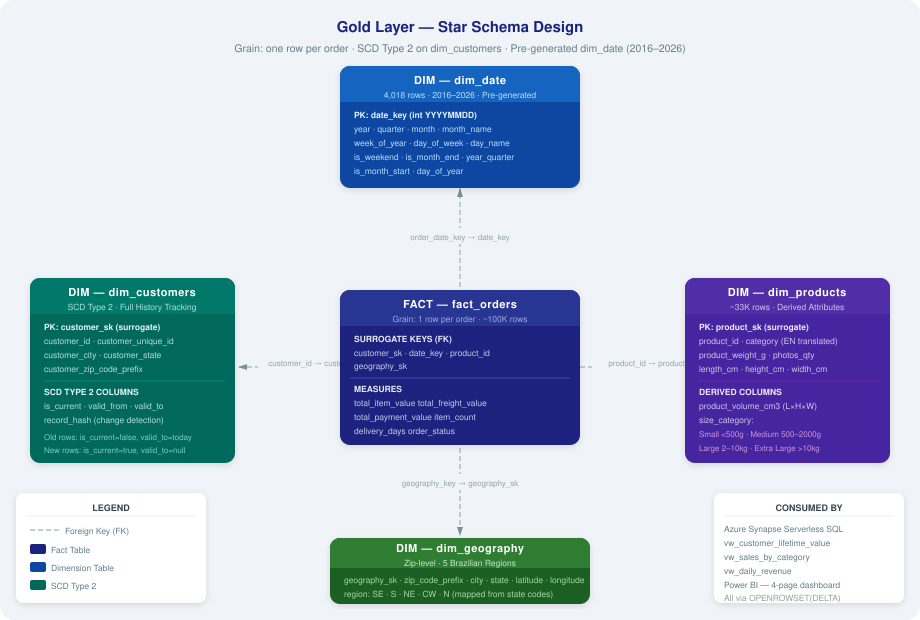

# Real-Time E-Commerce Data Lakehouse on Azure

An end-to-end data engineering platform implementing a **Medallion Architecture** (Bronze → Silver → Gold) for e-commerce analytics — covering batch ingestion, PySpark transformations, Delta Lake, Star Schema modeling, real-time streaming, SQL analytics, and CI/CD automation.

---

## Table of Contents

- [Project Overview](#project-overview)
- [Architecture](#architecture)
- [Tech Stack](#tech-stack)
- [Dataset](#dataset)
- [Project Structure](#project-structure)
- [Setup & Deployment](#setup--deployment)
- [Key Implementation Details](#key-implementation-details)
- [Screenshots](#screenshots)

---

## Project Overview

This platform processes e-commerce order, customer, product, and clickstream data through a multi-layer data lakehouse:

1. **Ingests** data from multiple sources (HTTP APIs, CSV files, streaming events) via Azure Data Factory
2. **Stores** raw data in Azure Data Lake Storage Gen2 (Bronze layer)
3. **Transforms** and cleanses data using Azure Databricks with PySpark and Delta Lake (Silver layer)
4. **Models** business-level metrics into a Star Schema with fact and dimension tables (Gold layer)
5. **Serves** analytics through Azure Synapse Serverless SQL and Power BI dashboards
6. **Streams** real-time clickstream events using Azure Event Hubs + Spark Structured Streaming
7. **Automates** infrastructure provisioning (Bicep) and deployments (Azure DevOps CI/CD)

---

## Tech Stack

| Category                  | Technology                                    |
| ------------------------- | --------------------------------------------- |
| Orchestration & Ingestion | Azure Data Factory                            |
| Big Data Processing       | Azure Databricks (PySpark)                    |
| Storage Format            | Delta Lake (ACID, MERGE, Time Travel)         |
| Data Lake                 | Azure Data Lake Storage Gen2                  |
| Data Warehouse            | Azure Synapse Analytics (Serverless SQL)      |
| Real-Time Streaming       | Azure Event Hubs + Spark Structured Streaming |
| Data Modeling             | Star Schema (Fact + Dimensions, SCD Type 2)   |
| Visualization             | Power BI                                      |
| Infrastructure as Code    | Bicep Templates                               |
| CI/CD                     | Azure DevOps (YAML Pipelines)                 |
| Security                  | Azure Key Vault, Managed Identity, RBAC       |
| Language                  | Python, PySpark, SQL / T-SQL                  |

---

## Architecture



### Medallion Architecture



| Layer      | Purpose                                 | Format               | Example                                |
| ---------- | --------------------------------------- | -------------------- | -------------------------------------- |
| **Bronze** | Raw data as-is from source              | Parquet / JSON / CSV | Raw order records from API             |
| **Silver** | Cleansed, validated, deduplicated       | Delta Lake           | Orders with valid dates, no duplicates |
| **Gold**   | Business-level aggregates & star schema | Delta Lake           | `fact_orders`, `dim_customers`         |

---

## Dataset

This project uses the **Brazilian E-Commerce Public Dataset** from [Kaggle](https://www.kaggle.com/datasets/olistbr/brazilian-ecommerce), supplemented with simulated clickstream data.

| File                                  | Records   | Description                   |
| ------------------------------------- | --------- | ----------------------------- |
| `olist_orders_dataset.csv`            | ~100K     | Order header data             |
| `olist_order_items_dataset.csv`       | ~113K     | Order line items              |
| `olist_customers_dataset.csv`         | ~99K      | Customer demographics         |
| `olist_products_dataset.csv`          | ~33K      | Product catalog               |
| `olist_sellers_dataset.csv`           | ~3K       | Seller information            |
| `olist_order_payments_dataset.csv`    | ~104K     | Payment details               |
| `olist_order_reviews_dataset.csv`     | ~100K     | Customer reviews              |
| `olist_geolocation_dataset.csv`       | ~1M       | Geolocation data              |
| `clickstream_events.json` (simulated) | Streaming | User browse/click/cart events |

---

## Project Structure

```
ecommerce-data-lakehouse-azure/
│
├── adf/                               # Azure Data Factory definitions
│   ├── linked_services/               #   Connection configs (Key Vault, ADLS, HTTP, Databricks)
│   ├── datasets/                      #   Data references (Bronze, Silver, Gold layers)
│   ├── pipelines/                     #   Ingestion, transformation, and master orchestration
│   └── triggers/                      #   Schedule and tumbling window triggers
│
├── databricks/                        # Databricks PySpark notebooks
│   ├── setup/                         #   Mount storage to DBFS
│   ├── bronze_to_silver/              #   Cleansing, validation, deduplication (4 notebooks)
│   ├── silver_to_gold/                #   Star Schema: fact + dimension tables (5 notebooks)
│   ├── streaming/                     #   Spark Structured Streaming pipeline
│   └── utils/                         #   Shared helper functions
│
├── synapse/                           # Synapse Serverless SQL
│   ├── external_tables/               #   OPENROWSET over Gold Delta Lake
│   ├── views/                         #   Analytical views (sales, CLV, revenue, sellers)
│   └── stored_procedures/             #   Data quality validation
│
├── infrastructure/                    # Infrastructure as Code (Bicep)
│   ├── main.bicep                     #   Master deployment template
│   ├── modules/                       #   Per-service Bicep modules
│   └── parameters/                    #   Dev and prod parameter files
│
├── devops/                            # CI/CD pipeline definitions
│   ├── azure-pipelines.yml            #   Multi-stage YAML pipeline
│   ├── templates/                     #   Stage templates (ADF, Databricks, Synapse)
│   └── scripts/                       #   Deployment helper scripts
│
├── data/                              # Sample data & configs
│   ├── raw/                           #   Kaggle CSV files (download instructions inside)
│   ├── configs/                       #   Pipeline config (file list for Lookup + ForEach)
│   └── simulated/                     #   Clickstream event generator
│
├── setup/                             # Azure resource provisioning & teardown scripts
├── powerbi/                           # Power BI dashboard design
├── tests/                             # Data quality tests (Bronze, Silver, Gold)
└── docs/                              # Setup guides & learning references
```

---

## Setup & Deployment

### Prerequisites

- Azure Subscription (Pay-As-You-Go)
- Azure CLI installed
- VS Code
- Git
- Kaggle account (for dataset download)
- Power BI Desktop (free)

### Quick Start

```bash
# 1. Clone the repo
git clone https://github.com/<your-username>/ecommerce-data-lakehouse-azure.git
cd ecommerce-data-lakehouse-azure

# 2. Copy and fill in your variables
cp setup/variables.sh.template setup/variables.sh
# Edit setup/variables.sh — set UNIQUE_SUFFIX, SUBSCRIPTION_ID, LOCATION, SYNAPSE_SQL_ADMIN_PASSWORD

# 3. Provision all Azure resources (creates all 6 services in one command)
chmod +x setup/provision_resources.sh
./setup/provision_resources.sh
```

For the complete step-by-step guide — including Azure Portal (UI) instructions, Databricks setup, ADF pipelines, Synapse SQL, streaming, Power BI, and cost optimisation — see **[docs/HANDS_ON_GUIDE.md](docs/HANDS_ON_GUIDE.md)**.

---

## Key Implementation Details

### Batch Ingestion (ADF)

- Config-driven ingestion using **Lookup + ForEach** pattern with parameterized datasets
- Master pipeline orchestrates ingestion → Bronze→Silver → Silver→Gold with dependency chains
- Schedule and tumbling window triggers for daily runs and historical backfills

### Data Transformation (Databricks + PySpark)

- **Bronze → Silver** (5 notebooks): Orders, Customers, Products, Payments, Order Items — type casting, null handling, deduplication, schema enforcement, business rule validation
- **Silver → Gold** (5 notebooks): Star Schema — `fact_orders` and 4 dimension tables (`dim_customers`, `dim_products`, `dim_date`, `dim_geography`)
- **Delta Lake MERGE** (UPSERT) for incremental loading
- **SCD Type 2** on `dim_customers` with `valid_from` / `valid_to` / `is_current` tracking

### Star Schema Design



- **Grain**: One row per order
- **fact_orders**: Measures (order_amount, freight_value, delivery_days) + foreign keys to all dimensions
- **dim_customers**: SCD Type 2 with full history
- **dim_products**: Derived columns (size_category, volume)
- **dim_date**: Pre-generated 2016–2026 with fiscal attributes
- **dim_geography**: Zip-level with region mapping

### Real-Time Streaming

- **Clickstream event generator** simulating user browse/click/cart behavior
- **Spark Structured Streaming**: Event Hubs → Bronze (raw append) → Silver (1-minute windowed aggregations)
- 5-minute watermark for late data tolerance, checkpointing for exactly-once semantics

### SQL Analytics (Synapse)

- Serverless SQL external tables over Gold Delta Lake using OPENROWSET
- Analytical views: sales by category, customer lifetime value, daily revenue, seller performance
- Data quality validation stored procedure

### Production Readiness

- **IaC**: Bicep templates for all Azure services
- **CI/CD**: Azure DevOps YAML pipeline — Validate → Deploy Infra → ADF → Databricks → Synapse
- **Security**: Key Vault for secrets, Managed Identity authentication, RBAC access control
- **Testing**: Data quality tests for all three medallion layers

---

## Architecture Diagrams

| Diagram | Description |
|---|---|
| [End-to-End Architecture](docs/images/architecture_overview.svg) | Full pipeline: Sources → ADF → Bronze → Databricks → Silver → Gold → Synapse + Power BI, with CI/CD strip |
| [Medallion Layers](docs/images/medallion_layers.svg) | Bronze / Silver / Gold layer breakdown: formats, tables, quality rules, and features |
| [Star Schema](docs/images/star_schema.svg) | Gold layer entity diagram: `fact_orders` + 4 dimensions with columns, SCD Type 2, and FK relationships |

---

## License

This project is for educational and portfolio purposes. Dataset is from [Kaggle — Olist Brazilian E-Commerce](https://www.kaggle.com/datasets/olistbr/brazilian-ecommerce) (public domain).

---

## Author

**Agrim Kumar** — Senior Azure Data Engineer

- LinkedIn: [linkedin.com/in/agrimk](https://linkedin.com/in/agrimk)
- GitHub: [github.com/agrimk16](https://github.com/agrimk16)
- Medium: [medium.com/@agrimk16](https://medium.com/@agrimk16)

---
